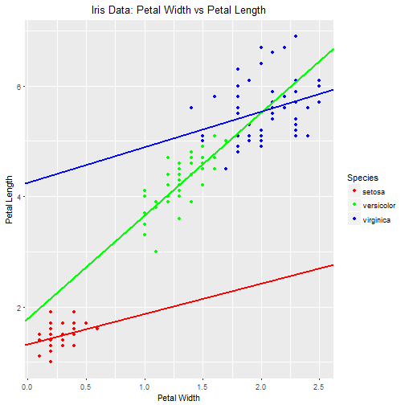

Developing Data Products Week 4 Project:  Iris Data Shiny Application
========================================================
author: 
date: 9-14-2017
autosize: true

The Iris Dataset Overview
========================================================

- Looks at data from 50 flower samples of 3 species of iris
- Included data parameters are Sepal Length, Sepal Width, Petal Length, Petal Width
- A further description as well as other information on this dataset can be found on the help page at <https://stat.ethz.ch/R-manual/R-devel/library/datasets/html/iris.html>.

Sample of Iris Dataset
========================================================


```
   Sepal.Length Sepal.Width Petal.Length Petal.Width Species
1           5.1         3.5          1.4         0.2  setosa
2           4.9         3.0          1.4         0.2  setosa
3           4.7         3.2          1.3         0.2  setosa
4           4.6         3.1          1.5         0.2  setosa
5           5.0         3.6          1.4         0.2  setosa
6           5.4         3.9          1.7         0.4  setosa
7           4.6         3.4          1.4         0.3  setosa
8           5.0         3.4          1.5         0.2  setosa
9           4.4         2.9          1.4         0.2  setosa
10          4.9         3.1          1.5         0.1  setosa
```

Shiny Application Overview
========================================================

- Objective
      - Predict the petal length for a particular species of iris based on the petal width using a simple linear model
- Inputs
      - The petal width for which a predicted petal length is desired
      - Species of iris that is of interest (can select any combination of the three species in the dataset)
- Outputs
      - Scatterplot of petal width vs petal length for the dataset with linear model overlays including prediction point
      - Predicted Petal Length for each species based on the input petal width
- App Location
      - <https://pulsar135.shinyapps.io/week4project/>

Sample of Shiny Application Base Scatterplot
========================================================


